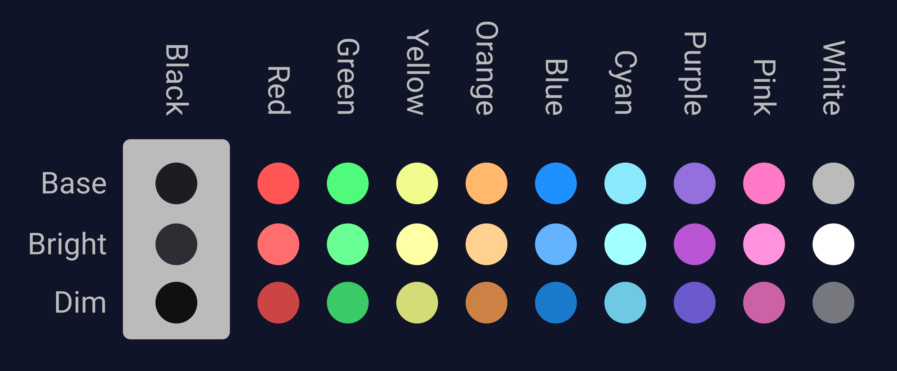
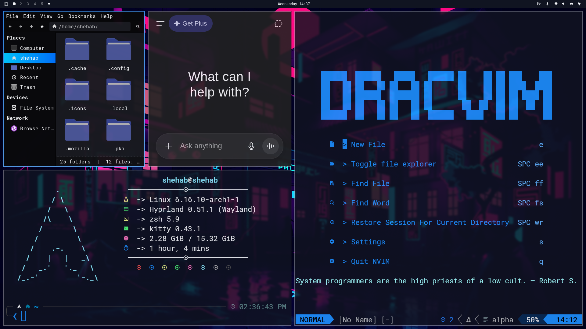
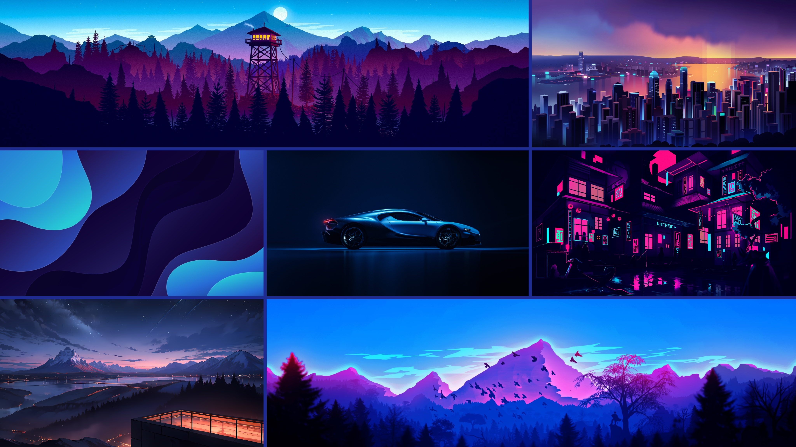

# 🐉 Omarchy Drac Theme  
> *“Where calm meets power — forged in shades of blue.”*

---

<p align="center">
  
  
  
  
  
</p>

---

### 🌌 About the Theme

**Omarchy Drac** is the **Blue Dragon** of the Omarchy realm — a deep, balanced theme built around harmony, focus, and elegant energy.  
It fuses **modern minimalism** with **mythic design** to create a seamless visual and coding experience across your entire Linux setup.

This repository contains the configurations and styles that bring the **Drac** theme to life across multiple applications.

---

### ⚙️ Included Configurations

- 🐧 **Hyprland** – Window manager setup  
- 🧭 **Waybar** – Status bar styling  
- 🔒 **Hyprlock** – Lock screen aesthetics
- 🐈‍⬛ **Kitty** - Feature rich terminal
- 🧩 **Ghostty** – Terminal look and feel  
- 🦇 **Alacritty** – Fast terminal with Drac colors  
- 🎛️ **Btop** – System monitor with themed palette  
- 🧠 **Neovim** – Custom Drac config *(see below)*  
- 🔔 **Mako** – Notification daemon theme  
- 🗂️ **Folder Icons** – Unified folder visuals  
- 💡 **SwayOSD** – On-screen display styling  
- ⚡ **Walker** – Launcher interface  

> Other tools and themes like **Cava**, **Thunar**, **GTK theme**, **Yazi**, **RMPD** and **more** are part of the same design vision.  
> If you’re interested in these or want to extend the Drac theme to your setup — **contact me**.

---

### 🧙‍♂️ Design Philosophy

The **Drac Theme** embodies the *Blue Dragon* — calm yet powerful.  
Every shade, shadow, and glow was chosen to represent:
- Serenity in work.  
- Depth in creation.  
- Precision in focus.  

It’s not just a theme — it’s a **presence** across your desktop.

---

### 📸 Previews

**Colorscheme Preview**


**Theme Preview**



**Backgrounds Preview**



---

### 🧩 Custom Components

#### 🧠 Neovim
> I used the [EdenEast/nightfox.nvim](https://github.com/EdenEast/nightfox.nvim) theme, However, I changed the colors' value to my colorscheme.

#### 🖼️ GTK Theme
I use a group of packages for my theme:
- 🖱️ **cursor** - Sweet Cursors
- 📁 **Folder Icons** - Reversal Blue Dark
- 💻 **GTK Theme** - Sweet Ambar Blue Dark v40

> Note: All these are not include in this repo. I used in this repo the **Yaru-blue*. If you want know anything about these feel free to contact.

---

### 🪄 Installation

> Run this command in your terminal:

```bash
omarchy-theme-install https://github.com/ShehabShaef/omarchy-drac-theme
```
---

### 🧭 Contact & Collaboration

If you have:

Questions about integrating the theme
Requests for additional Drac-compatible configs
or Other dotfiles you interested in

Feel free to reach out or open an issue.
Let’s grow the Omarchy world together. 🐉

---

### ⚔️ License (MIT)

Open-source, but crafted with purpose.
If you remix or build upon this, please credit Omarchy and link back to this repository.

---

> “From calm waters, wisdom flows —
> From blue light, creation grows.” 🌊
